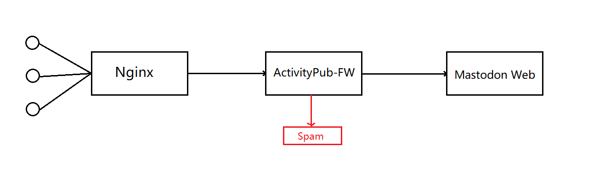

# ActivityPub-FW (alpha)

A middleware inspired by [great-ebichiri-wall](https://github.com/shrimpia/great-ebichiri-wall) to filter incoming inbox messages. However, **in local**.

We do not need to take care about running out of free daily requests when using an online worker, especially in huge spam waves.



# Usage
Use as a middleware in front of an activity pub api server and behind your front proxy server(usually nginx).

```bash
Usage: ./activitypub-fw [-c config_file]
  -c string
        Path to the JSON configuration file (default "config.json")
  -h    Print this message
```

# Configuration
```json5
{
    "server": {
        "address": "[::]", // Where we listen. Configure your front proxy server(usually nginx) to contact this. Only works if protocol is "tcp". IPv6 address should be in "[]"
        "path": "/var/run/activitypub-fw.sock", // Where we listen. Configure your front proxy server(usually nginx) to contact this. Only works if protocol is "unix"
        "port": 8080, // Only works if protocol is "tcp"
        "protocol": "tcp", // "tcp" or "unix"
        "readTimeout": 5, // Second(s)
        "writeTimeout": 10, // Second(s)
        "idleTimeout": 120, // Second(s)
        "inboundProxyNetworks": [ // String array of IP addresses or networks in CIDR. X-Forwarded headers from these networks will be trusted. Always be trusted if protocol is unix
            "127.0.0.1",
            "::1"
        ]
    },
    "proxy": {
        "protocol": "tcp", // "tcp" or "unix"
        "url": "http://172.23.91.135", // Only works if protocol is "tcp"
        "unixPath": "/var/run/mastodon-website.sock", // Points to backend server. eg. mastodon website(not streaming)'s domain socket file. Only works if protocol is "unix"
        "forceAttemptHttp2": true,
        "maxConnsPerHost": 256,
        "maxIdleConns": 100,
        "maxIdleConnsPerHost": 5,
        "idleConnTimeout": 120, // Second(s)
        "tlsHandshakeTimeout": 10, // Second(s)
        "expectContinueTimeout": 1, // Second(s)
        "keepAlive": 30, // Second(s)
        "timeout": 30, // Second(s)
        "writeBufferSize": 4096, // Bytes
        "readBufferSize": 4096 // Bytes
    },
    "limit": {
        "maxBodySize": 1048576, // Bytes, requests with larger body will be passed-through
        "cc": 6, // max cc counts in ActivityPub messages
        "mentions": 5,  // max mentions(at counts) in ActivityPub messages
        "keywords": [] // string array, any ActivityPub message which matches one of these keywords will be filtered
    }
}
```

# Set-up
Assume you are running a mastodon instance behind a proxy server(nginx).

Here is a sample nginx configuration section.

```
# Comment original upstream "website"
upstream backend {
 server unix:/var/run/mastodon-website.sock fail_timeout=0;
}
# ActivityPub-FW acts like a middleware, which will contact ```/var/run/mastodon-website.sock``` instead
upstream activitypub_fw {
 server unix:/var/run/activitypub-fw.sock fail_timeout=0;
}

location @activitypub_fw {
    proxy_set_header Host $host;
    proxy_set_header X-Real-IP $remote_addr;
    proxy_set_header X-Forwarded-For $proxy_add_x_forwarded_for;
    proxy_set_header X-Forwarded-Proto https;
    proxy_set_header Proxy "";
    proxy_pass_header Server;

    proxy_pass http://activitypub_fw;
    proxy_buffering on;
    proxy_redirect off;
    proxy_http_version 1.1;
    proxy_set_header Upgrade $http_upgrade;
    proxy_set_header Connection $connection_upgrade;

    proxy_cache CACHE;
    proxy_cache_valid 200 7d;
    proxy_cache_valid 410 24h;
    proxy_cache_use_stale error timeout updating http_500 http_502 http_503 http_504;
    add_header X-Cached $upstream_cache_status;

    tcp_nodelay on;
}

location = /api/i/update {
    try_files $uri @activitypub_fw;
}

location = /api/notes/create {
    try_files $uri @activitypub_fw;
}

location /inbox {
    try_files $uri @activitypub_fw;
}

location /users {
    try_files $uri @activitypub_fw;
}
```

# Features
- ✅ Basic filtering by ```At(@)``` and ```Mentions(cc)``` in an ActivityPub message
- ✅ Basic Blacklist support for content filtering
- ✅ Basic partial hot reload
- Make an easy-to-use UI
- Real time analyzation/log
- Further integrations: anti-spam, ...
- ...